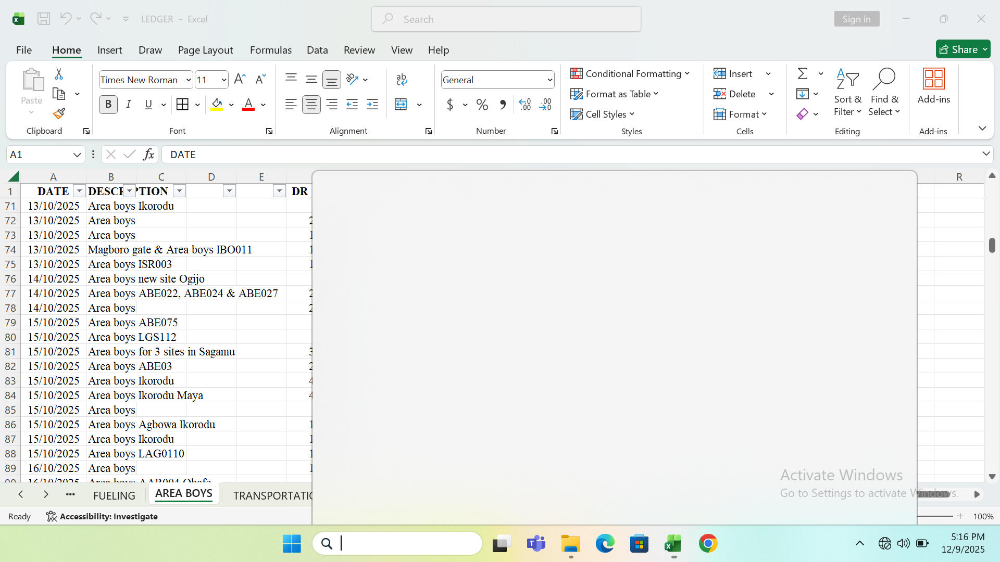

# Power-BI-Global-Sales-Dashboard
Global sales Performance Dashboard built in Power-BI using the standard financial Sample Dataset
# Global Sales & Performance Executive Dashboard

## Project Overview
A dynamic Global Sales Performance Executive Dashboard developed in Power BI using Microsoft’s native Financial Sample dataset. This project demonstrates foundational data modeling, visual hierarchy, and executive-level KPIs tailored for cross-border commercial analysis.

## Dashboard Preview

## Key Features & Business Analytics
* **Global Market Analysis:** Visualized commercial sales, unit distribution, and profit margins across 5 international countries (Germany, Canada, France, Mexico, and the United States).
* **Segment & Product Profiling:** Developed comparative visuals analyzing revenue generation across diverse product categories (Carretera, Paseo, VTT, etc.) and buyer segments.
* **Revenue Optimization Tracking:** Modeled the relationship between Gross Sales, Discount Bands, and actual Net Sales to show the direct impact of promotional discounting on final profitability.

## Tools & Technical Competencies Used
* **Power BI Desktop:** Canvas layout design, data view modeling, and cross-filtering interactions.
* **Data Presentation Polish:** Structured clean visual paths to map the clear variance between Gross Sales and final Net Sales.
